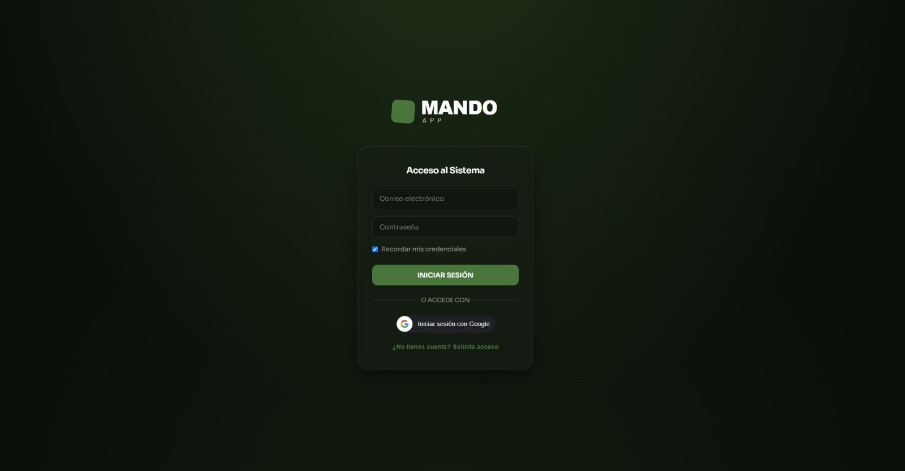

# AppMando: Sistema Centralizado de Gestión Táctica y Operativa


*Acceso a la plataforma web: [app.promilitar.es](https://app.promilitar.es)*

## 🎯 Contexto Operativo (El Problema y la Solución)

**AppMando** nace de una necesidad operativa real en el ámbito militar. La gestión de tareas, el control de disponibilidad de subordinados y la coordinación de agendas suelen fragmentarse entre libretas físicas, grupos de mensajería no seguros y hojas de cálculo desincronizadas. Esta fragmentación genera brechas de eficiencia y pérdida de información crítica.

Para resolverlo, desarrollé esta plataforma: una solución *Full-Stack* centralizada que unifica el estado del personal, la asignación de tareas y el reporte de novedades en tiempo real, accesible de forma segura desde cualquier dispositivo (Web, Desktop y Móvil vía PWA/Capacitor).

No es un concepto teórico; es la herramienta operativa en producción que gestiona el flujo de trabajo diario de una unidad.

## 🏗️ Arquitectura y Stack Tecnológico

La aplicación está diseñada bajo una arquitectura Cliente-Servidor ligera y autónoma, priorizando la velocidad de despliegue y la seguridad de los datos.

**Frontend (Cliente PWA)**
*   **Core:** React 18 + Vite 5 (JavaScript puro).
*   **Autenticación:** `@react-oauth/google` para el acceso seguro mediante SSO.
*   **Exportación Táctica:** `jsPDF` y `html2canvas` para generar partes y reportes diarios en formato PDF.
*   **Accesibilidad Operativa:** Web Speech API implementada para el registro de novedades por dictado de voz (*Hands-free*).
*   **Despliegue Móvil:** Capacitor 6 para empaquetado nativo en Android y configuración PWA (Service Worker + Manifest).

**Backend (API Rest)**
*   **Core:** Node.js + Express.
*   **Base de Datos:** SQLite (Despliegue en fichero único `appmando.db`, asegurando portabilidad y cero administración externa).
*   **Seguridad y Sesiones:** JSON Web Tokens (JWT) firmados, encriptación de credenciales con `bcrypt`.
*   **Comunicaciones:** Web Push API para el despliegue de notificaciones tácticas en tiempo real.

## 🛡️ Enfoque de Seguridad y Privacidad (Core)

Dado el entorno operativo para el que fue concebida, la plataforma implementa los siguientes controles de seguridad por diseño (Security by Design):

*   **Aislamiento de Datos (Tenant Isolation):** La API implementa filtros estrictos por ID de usuario en cada *endpoint*. Es imposible la filtración cruzada de datos entre sesiones.
*   **Criptografía de Credenciales:** Almacenamiento exclusivo de *hashes* generados mediante `bcrypt` con *salting* automático. Las contraseñas en texto plano nunca tocan la base de datos.
*   **Gestión de Sesiones:** Tokens JWT de corta duración, firmados con secretos inyectados vía variables de entorno (`.env`), nunca hardcodeados en el código fuente.
*   **Sanitización del Repositorio:** El control de versiones excluye sistemáticamente mediante `.gitignore` cualquier archivo sensible (bases de datos de producción `appmando.db`, llaves VAPID `vapid.json` y configuraciones locales de entorno).

## 📂 Estructura del Proyecto

```text
.
├── src/                    # Frontend React (Cliente Web/PWA)
│   ├── components/         # Módulos operativos (Auth, Dashboard, Calendar, etc.)
│   ├── App.jsx             # Enrutamiento y gestión de estado
│   └── main.jsx            # Entry point
├── backend/                
│   └── server.js           # Servidor API REST (Express) e interacción SQLite
├── android/                # Proyecto nativo Android generado por Capacitor
└── public/                 # Assets estáticos y Manifest PWA
```

## ⚙️ Despliegue en Entorno de Desarrollo (Local)

Para auditar el código o ejecutar la plataforma en un entorno local aislado:

**1. Despliegue de la API (Backend)**
```bash
cd backend
npm install
node server.js # Inicializa el servicio en el puerto 3000 y autogenera appmando.db
```
*(Requiere configurar el archivo `.env` con las variables `JWT_SECRET`, `GOOGLE_CLIENT_ID` y las claves `VAPID` para notificaciones).*

**2. Despliegue del Cliente Web (Frontend)**
```bash
# Desde la raíz del proyecto
npm install
npm run dev # Levanta el entorno de desarrollo con Vite

